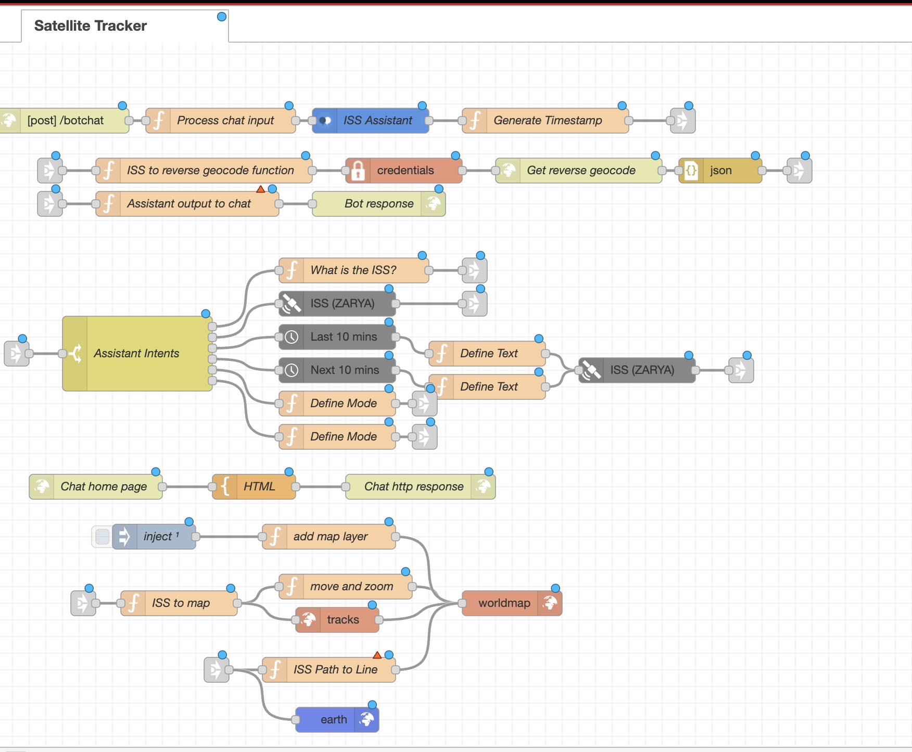

# Satellite Tracker

A real-time ISS tracking chatbot built on [Node-RED](https://nodered.org/) with IBM Watson Assistant. Users can ask questions about the International Space Station and get live location data, historical trajectory, future orbit predictions, and interactive 2D/3D map visualizations.



---

## Features

- **Real-time ISS location** — live coordinates with reverse geocoding to human-readable place names
- **AI chatbot interface** — IBM Watson Assistant v2 handles natural language intent recognition
- **2D world map** — interactive map with ISS position marker and orbit track overlay
- **3D Earth view** — toggle to a globe visualization showing the ISS in context
- **Historical path** — show where the ISS has been over the last 10 minutes
- **Future trajectory** — show where the ISS is heading over the next 10 minutes
- **Web UI** — dark-themed Bootstrap chat interface with an embedded live map

---

## How It Works

```
User message → Watson Assistant (intent detection)
                        ↓
             Route by intent (what / where / historical / future / mode)
                        ↓
             Satellite node fetches TLE-based position data
                        ↓
             Reverse geocode coordinates via OpenStreetMap Nominatim → readable location
                        ↓
             Push to WorldMap / Earth visualization nodes
                        ↓
             Return response to chat UI at /bot
```

The Node-RED flow exposes two HTTP endpoints:
- `GET /bot` — serves the chat + map web interface
- `POST /botchat` — REST API endpoint consumed by the UI

---

## Prerequisites

- **Node-RED** v3.x or later ([install guide](https://nodered.org/docs/getting-started/))
- **IBM Cloud account** with a Watson Assistant v2 service instance
- The following Node-RED palette packages (install via **Manage Palette** in the editor):

| Package | Provides |
|---|---|
| `node-red-contrib-web-worldmap` | `worldmap`, `worldmap-tracks` nodes |
| `node-red-node-watson` | `watson-assistant-v2` node |
| `node-red-node-satellite` | `satellite` node (TLE-based position) |
| `node-red-node-timearray` | `timearray` node (historical/future windows) |
| `node-red-contrib-3d-earth` | `earth` node (3D globe view) |

> **Note:** Reverse geocoding uses [OpenStreetMap Nominatim](https://nominatim.openstreetmap.org/) — no API key required.

---

## Installation

### 1. Install Node-RED

Follow the [official guide](https://nodered.org/docs/getting-started/) for your platform, or run:

```bash
npm install -g --unsafe-perm node-red
```

### 2. Install required palette nodes

Start Node-RED, open the editor at `http://localhost:1880`, then go to **Menu → Manage Palette → Install** and search for each package listed in the table above.

### 3. Import the flow

1. Open **Menu → Import**
2. Click **select a file to import** and choose `flows/satellite-tracker.json`
3. Click **Import**

### 4. Configure Watson Assistant

1. Create a **Watson Assistant** service on [IBM Cloud](https://cloud.ibm.com/)
2. Create an assistant and note your:
   - **API Key**
   - **Service URL**
   - **Assistant ID**
3. In the Node-RED editor, double-click the **ISS Assistant** node and enter your credentials
4. In Watson Assistant, create a skill with the following intents:

| Intent | Example utterances |
|---|---|
| `what` | "What is the ISS?", "Tell me about the space station" |
| `where` | "Where is the ISS?", "Show me the current location" |
| `where-historical` | "Where has it been?", "Show last 10 minutes" |
| `where-future` | "Where is it going?", "Show the future path" |
| `mode-2d` | "Switch to 2D", "Show the map" |
| `mode-3d` | "Switch to 3D", "Show the globe" |

### 5. Deploy

Click the **Deploy** button in Node-RED. The app is now live at `http://localhost:1880/bot`.

---

## Project Structure

```
Satellite-Tracker/
├── flows/
│   └── satellite-tracker.json   # Node-RED flow (import this into your editor)
├── config/
│   └── credentials.example.json # Placeholder showing required credentials
├── docs/
├── README.md
└── .gitignore
```

---

## Technologies

| Technology | Role |
|---|---|
| [Node-RED](https://nodered.org/) | Flow-based runtime and web server |
| [IBM Watson Assistant v2](https://www.ibm.com/cloud/watson-assistant) | Natural language understanding |
| [node-red-contrib-web-worldmap](https://flows.nodered.org/node/node-red-contrib-web-worldmap) | 2D interactive map with ISS tracking |
| [node-red-node-satellite](https://flows.nodered.org/node/node-red-node-satellite) | TLE-based satellite position calculation |
| [OpenStreetMap Nominatim](https://nominatim.openstreetmap.org/) | Free reverse geocoding (no API key needed) |
| Bootstrap 3 + jQuery | Chat UI frontend |
| Leaflet (via WorldMap node) | Underlying map renderer |